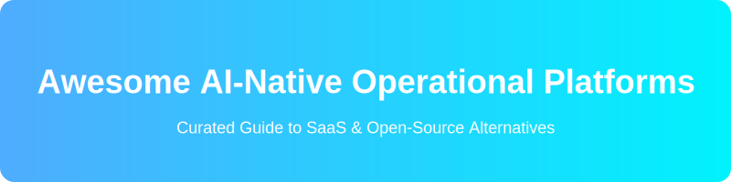

  

  
  

# 🚀 Awesome AI-Native Operational Platforms

Welcome to the definitive guide on **AI-Native Operational Platforms**! 🌟
This curated list provides a comprehensive overview of leading **SaaS/cloud-hosted AI-native operational platforms** and their **open-source/self-hosted equivalents**. Whether you're building a data lakehouse, implementing machine learning ops, or searching for the best enterprise AI solutions, you've come to the right place. 📊💡

**Open-source solutions are emphasized** 🛠️ for flexibility, cost efficiency, and building AI-powered data operations on open lakehouse architectures.

---

## ☁️ SaaS / Cloud-Hosted AI-Native Operational Platforms

Explore the most popular unified platforms combining data engineering, analytics, ML/AI, and operational workflows with built-in intelligence. 🧠

### 🏆 Leading Options

| Platform | Description | Pricing Model | Free Tier Limit | Company Size / Valuation |
|---|---|---|---|---|
| **[Microsoft Fabric](https://microsoft.com/fabric)** | End-to-end analytics platform with Copilot integration. | Pay-as-you-go / Reserved Capacity | 60-day Free Trial | ~$3T (Market Cap) |
| **[Snowflake](https://snowflake.com)** | Cloud data platform with Cortex AI. | Consumption-based | 30-day Free Trial ($400 credits) | ~$50B (Market Cap) |
| **[Databricks](https://databricks.com)** | Lakehouse platform with strong AI/BI Genie, Mosaic AI. | Pay-as-you-go | Free Community Edition | ~$43B (Valuation) |
| **[Dataiku](https://dataiku.com)** | Collaborative data science and automation platform. | Subscription-based | Free Edition (up to 3 users) | ~$4.6B (Valuation) |
| **[Alteryx](https://alteryx.com)** | Collaborative data science platform with AI features. | User-based Subscription | 30-day Free Trial | ~$4.4B (Acquired) |
| **[C3 AI](https://c3.ai)** | Enterprise AI applications for operations. | Subscription + Consumption | Contact Sales | ~$3B (Market Cap) |
| **DataWalk** | Intelligence and operations analytics. | Enterprise Subscription | Contact Sales | ~$50M (Market Cap) |
| **d.AP** | Operational AI platform. | Enterprise Subscription | Contact Sales | N/A |
| **Adaptrix** | AI-native operations platform. | Enterprise Subscription | Contact Sales | N/A |

---

## 🏗️ Open-Source / Self-Hosted Alternatives

Leverage open lakehouse tech, Spark, and AI frameworks to replicate AI-native operational capabilities. 🌐

### 🌟 Featured Projects

- **LangChain**  — Agents + lakehouse for custom operational AI assistants.
- **Apache Spark**  + **Delta Lake**  / **Iceberg**  — Foundation for lakehouse operations.
- **ClickHouse**  — Real-time operational analytics.
- **Apache Airflow**  — Orchestration of AI workflows.
- **MLflow**  — Managing ML lifecycles in operational AI.
- **dbt Core**  + **Meltano**  — Transformation pipelines feeding AI models.
- **Trino**  / **Starburst** — Distributed SQL query engine.
- **Great Expectations**  — Open alternatives for data quality in AI ops.
- **Dremio**  — Open lakehouse platform with semantic layer.

💡 **Tip**: Build a modern open AI-native stack with **Apache Iceberg**, **Spark**, **Trino**, and **MLflow**.

---

## ⚖️ Comparison

| Aspect | SaaS Platforms | Open-Source / Self-Hosted |
|---|---|---|
| **Cost** 💸 | High subscription + usage | Lower (infra + engineering) |
| **Customization** 🎨 | Vendor roadmaps | Full architecture and model control |
| **Integration** 🔗 | Managed ecosystem | Flexible but requires assembly |
| **Setup Effort** ⏱️ | Quick cloud onboarding | Significant for self-managed |
| **Use Case** 🎯 | Enterprises wanting managed AI ops | Cost-conscious, custom, or open-preferring teams |

---

## 🚀 Getting Started

1. Adopt an open lakehouse format (Iceberg recommended). 🧊
2. Use **Spark** / **Trino** for processing and **dbt** for transformations. ⚡
3. Integrate **MLflow** for AI model operations. 🤖
4. Add orchestration with **Airflow** and agents via open LLM frameworks. 🌬️
5. Deploy on Kubernetes for scalability. ☸️

## 🤝 Contributing

Feel free to submit PRs to expand this list with more projects, tools, or comparisons! Inspired by [Awesome](https://github.com/ishandutta2007/Awesome-Awesome-Awesome).

**Last updated**: July 2026 📅
*AI operational platforms evolve fast — always check the latest on official repos and evaluate total cost of ownership.*

## 📈 Star History

<a href="https://www.star-history.com/?repos=ishandutta2007%2FAwesome-AI-native-Operational-Platforms&type=date&legend=bottom-right">
<picture>
<source media="(prefers-color-scheme: dark)" srcset="https://api.star-history.com/chart?repos=ishandutta2007/Awesome-AI-native-Operational-Platforms&type=date&theme=dark&legend=bottom-right" />
<source media="(prefers-color-scheme: light)" srcset="https://api.star-history.com/chart?repos=ishandutta2007/Awesome-AI-native-Operational-Platforms&type=date&legend=bottom-right" />

</picture>
</a>

